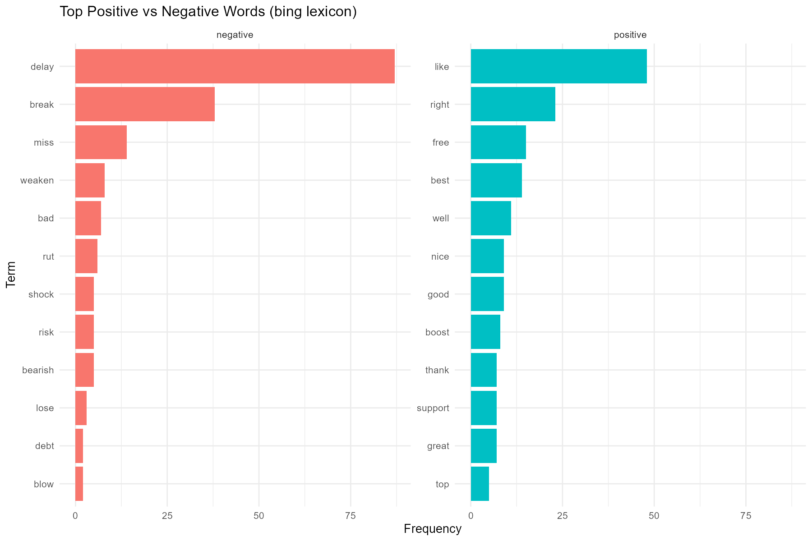

# Apple Tweets Sentiment Analysis (R)

Analyze public sentiment around Apple using a reproducible R workflow
(text preprocessing, word frequencies, word clouds, and NRC lexicon sentiment).

> **Tech stack:** R, tm, syuzhet, ggplot2, wordcloud/wordcloud2, dplyr, SnowballC

## 🎯 Project goals
- Clean and normalize tweet text
- Visualize frequent terms (bar chart, word cloud)
- Score emotions & polarity with the NRC lexicon
- Export publication-ready figures to `figures/`

## 📁 Repository structure
```
apple-sentiment-analytics/
├─ data/                # Put apple.csv here (see below)
├─ figures/             # Output charts saved here
├─ src/
│  └─ sentiment_analysis.R
├─ install.R            # One-time package installer
├─ LICENSE              # MIT
└─ README.md
```

## 📦 Setup

1) **Install dependencies** (first run only):
```r
source("install.R")
```

2) **Add the dataset:**
- Download `apple.csv` from a public source like Kaggle (e.g. Apple Tweets dataset used in tutorials).
- Place the file at: `data/apple.csv`

> If you use someone else’s dataset or tutorial for inspiration, please **credit the source** in this README.

3) **Run the analysis:**
```r
source("src/sentiment_analysis.R")
```
This will generate:
- `figures/frequent_words_barplot.png`
- `figures/wordcloud.png`
- `figures/sentiment_scores_barplot.png`

## 📝 Method overview
- **Text cleaning**: lowercase, remove punctuation/numbers/URLs/stopwords; stemming; custom domain terms removed (`aapl`, `apple`).
- **Term frequency**: Term-Document Matrix via `tm`; top terms visualized.
- **Sentiment**: `syuzhet::get_nrc_sentiment()` for 10 emotion/polarity categories.
- **Visuals**: Base R + ggplot2 + wordcloud/wordcloud2.

## 🔍 Key insights (example from my run)
- Discourse clusters around **earnings**, **reports**, and **stock movement**.
- Mixed sentiment: high **negative** but also strong **anticipation** and **trust**, reflecting market tension.

## 🤝 Attribution
Inspired by community tutorials on text mining in R.
If you adapt from a specific notebook (e.g., Kaggle), please add a link here and describe **what you changed**.

## ⚖️ License
MIT — see `LICENSE`.




---

**Author:** Eva Samitova  
**Course:** Text Analytics  
**Date:** 2025-07

